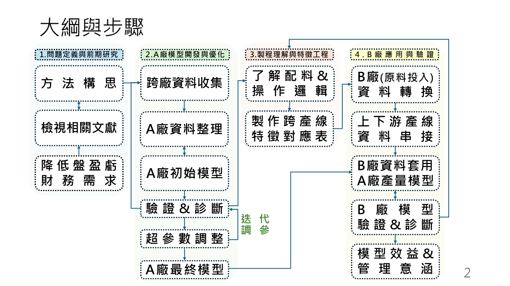
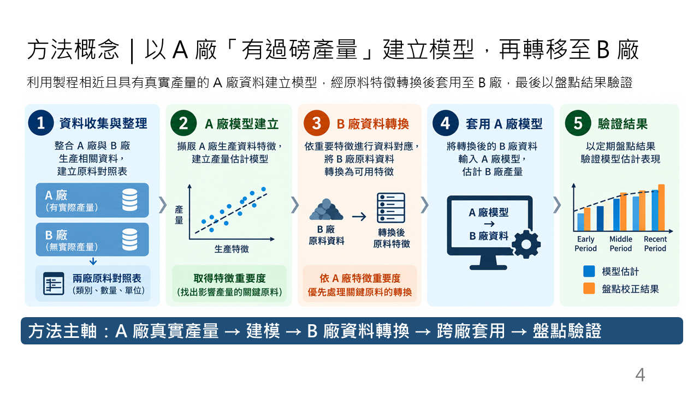
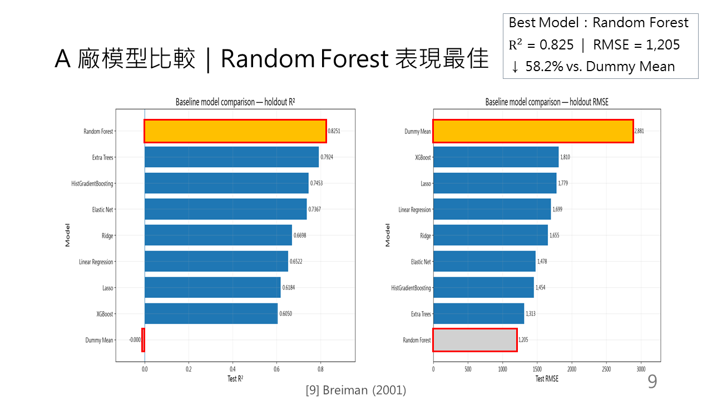
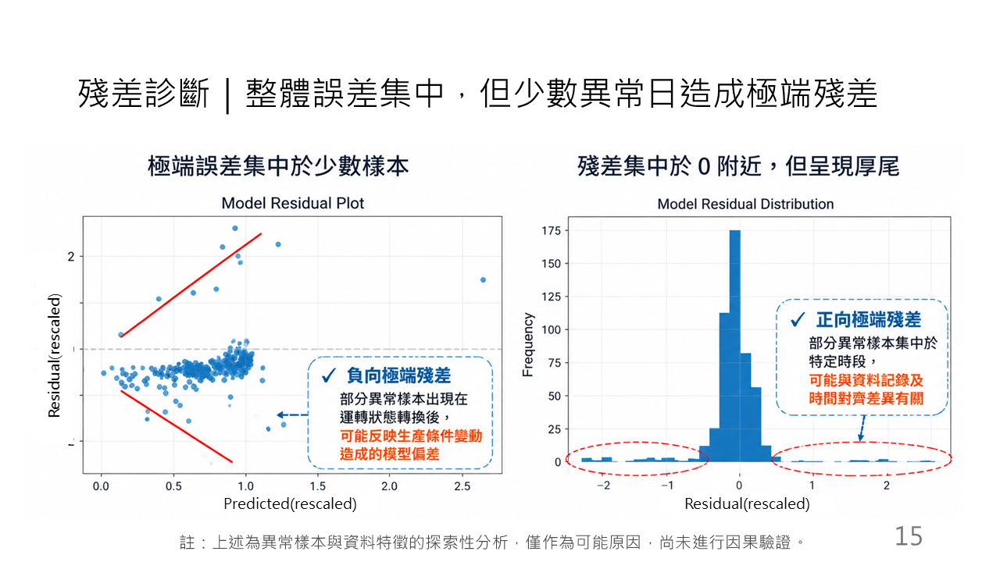
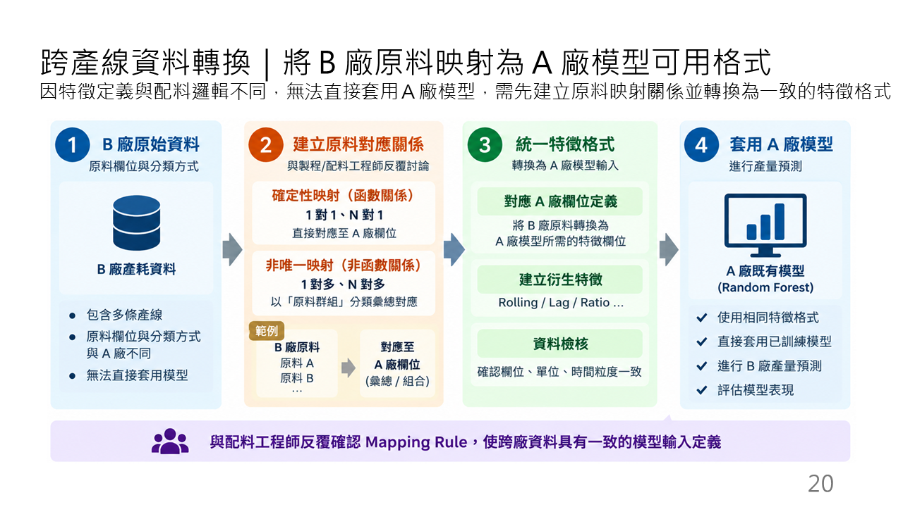
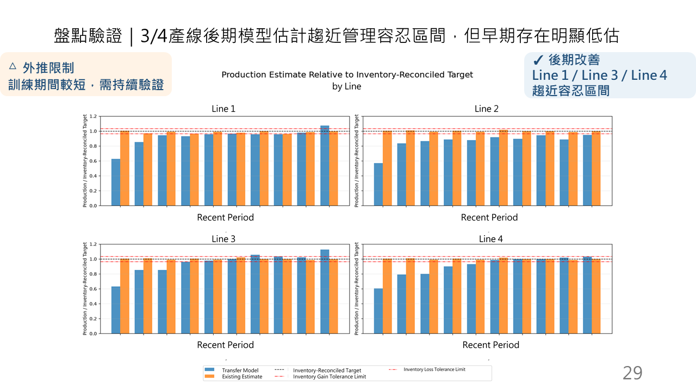
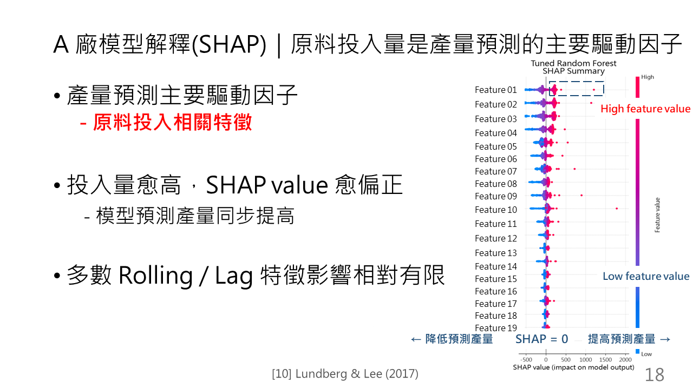
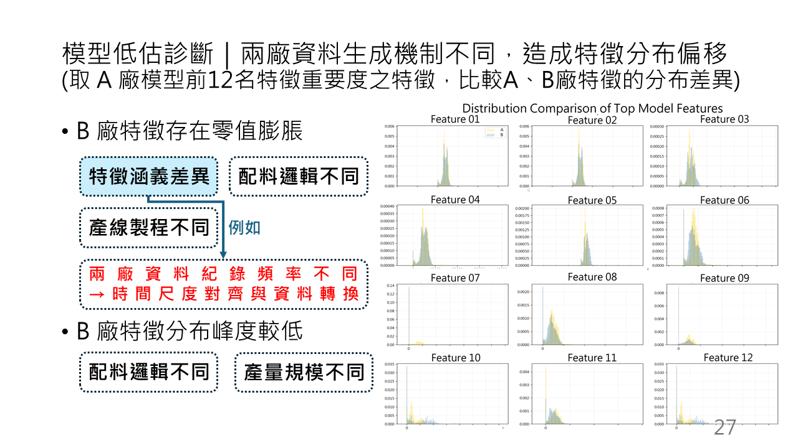

# Machine Learning-Based Soft Sensor for Cross-Plant Production Estimation

> An end-to-end industrial machine learning project for estimating production output when direct measurements are unavailable at the target plant.

**Industrial ML · Soft Sensor · Random Forest · Time-Series Validation · SHAP · Cross-Plant Transfer · Distribution Shift**

---

## At a Glance

| Area | Key result |
| --- | --- |
| Problem | Estimate production output at a target plant without direct daily production measurements |
| Source-plant model | **Random Forest** |
| Source-plant holdout R² | **0.825** |
| Source-plant holdout RMSE | **1,205** (original target units; unit details withheld) |
| Improvement | **58.2% lower RMSE** than a Dummy Mean baseline on the source-plant evaluation |
| Transfer outcome | Target-plant estimates were less volatile but showed systematic underestimation; further validation is needed |


---

## 1. Project Overview

This project develops a **machine learning-based soft sensor** for cross-plant production estimation, covering **the full industrial ML workflow** from problem definition and data preparation to model development, cross-plant transfer, error diagnosis, and operational validation.



### Project Highlights

- Developed a production soft sensor using multi-year industrial process data
- Compared linear and tree-based machine learning models
- Applied **date-based holdout** and **expanding-window cross-validation**
- Achieved **R² = 0.825** on the source-plant holdout set using Random Forest
- Reduced RMSE by **58.2%** compared with the Dummy Mean baseline
- Built a cross-plant feature-mapping pipeline for model transfer
- Applied residual analysis and SHAP for model interpretation
- Diagnosed residual anomalies and cross-plant distribution shift
- Validated transferred estimates against inventory-reconciled production results

---

## 2. The Problem

The source plant has observable production measurements, while the target plant lacks direct production measurements.

The objective was therefore to learn the relationship between process inputs and production at the source plant, then determine whether that relationship could be transferred to another production environment.



---

## 3. Model Development & Performance

Several regression and tree-based models were evaluated, including:

`Linear Regression` · `Lasso` · `Ridge` · `Elastic Net` · `Random Forest` · `Extra Trees` · `HistGradientBoosting` · `XGBoost`

Instead of random train/test splitting, a **date-based holdout** was used to better represent the real deployment scenario of learning from historical data and estimating future production.

Model stability was further evaluated using **5-fold expanding-window cross-validation**.

### Best Model — Random Forest

- **R² = 0.825**
- **RMSE = 1,205**
- **58.2% RMSE reduction vs. Dummy Mean**



---

## 4. Error Analysis & Failure Diagnosis

Model evaluation did not stop at aggregate performance metrics.

Residual analysis showed that most errors were concentrated near zero, while a small number of abnormal observations generated extreme residuals.

Further investigation suggested that some extreme errors were associated with differences in **data-recording timing and post-maintenance operating conditions**.



This analysis showed that large prediction errors were often associated with unusual operating conditions or data-recording patterns.

> **Analyzing prediction errors helped identify patterns that were not captured by the model.**

---

## 5. Cross-Plant Model Transfer

Direct model transfer was not feasible because the source and target plants differed in the number of features, feature definitions, and operating logic.

A feature-mapping pipeline was therefore developed to transform target-plant data into a representation compatible with the source-plant model.

**Target-Plant Data → Feature Mapping → Feature Reconstruction → Source-Model-Compatible Dataset → Production Estimation**



This step included reconstructing derived features such as rolling, lag, ratio, and aggregated variables after the underlying inputs had been aligned.

---

## 6. Cross-Plant Validation

The transferred model was evaluated using inventory-reconciled production information rather than relying solely on machine-learning metrics.

Estimates for several production lines approached the management tolerance range in later periods, while earlier periods showed systematic underestimation.



The results indicate that the model can provide a **secondary production estimate for operational analysis**, while its application still requires domain knowledge, inventory reconciliation, periodic retraining, and ongoing validation.

---

## 7. Model Interpretation

Feature importance and SHAP were used to examine how the Random Forest generated its predictions.

Material-input-related features were the dominant drivers of estimated production, while many lag and rolling features contributed relatively less.



Feature names are anonymized in this public version.

---

## 8. Distribution Shift

Applying the model to the target plant revealed substantial differences between the source and target domains.

The analysis identified differences in:

- Feature distributions
- **Zero-inflated** variables
- Material-mixing logic
- Production processes
- Data-recording timing
- Production scale



These differences help explain why a model that performs well in the source plant does not necessarily transfer directly to another production environment.

Beyond the initial challenges of cross-plant model transfer and the lack of directly observed production values in the target plant, the analysis revealed additional issues, including **feature distribution shifts** and **differences in data collection timing**.

---

## 9. Key Lessons

### Data understanding matters more than model complexity

A large part of the project involved understanding feature definitions, operational logic, abnormal observations, and differences between production environments.

### Time-aware validation is essential

Random splitting can overestimate model generalization when observations are time-dependent. Date-based holdout and expanding-window validation better reflect real deployment conditions.

### Cross-plant transfer introduces domain shift 

Similar manufacturing processes do not guarantee identical data distributions. Differences in the number of features, feature definitions, operating logic, production scale, and data collection timing can significantly affect transferability.

### Model failure can be informative

Systematic prediction errors helped identify structural differences between the source and target environments.

### Industrial AI supports — rather than replaces — operational management

The objective is not to build a “perfect” production model, but to establish a complete workflow:

**Data → Modeling → Cross-Plant Transfer → Failure Diagnosis → Operational Validation**

---

## Tools & Methods

**Data & Programming**  
`Python` · `Pandas` · `NumPy`

**Machine Learning**  
`scikit-learn` · `XGBoost`

**Validation & Optimization**  
`Date-Based Holdout` · `Expanding-Window Cross-Validation` · `Randomized Search`

**Interpretation & Diagnostics**  
`SHAP` · `Residual Analysis` · `Distribution-Shift Analysis`

**Visualization**  
`Matplotlib`

---

## Project Structure

```text
public/
├── figures/
│   ├── 00_project_overview.png 
│   ├── 01_project_workflow.png
│   ├── 02_model_performance.png
│   ├── 03_residual_diagnostics.png
│   ├── 04_cross_plant_mapping.png
│   ├── 05_transfer_validation.png
│   ├── 06_shap_analysis.png
│   └── 07_distribution_shift.png
<!-- │
└── presentation/
    └── Machine_Learning-Based_Soft_Sensor_for_Cross-Plant_Production_Estimation.pdf -->
```

<!-- --- -->

<!-- ## Full Presentation

📄 **[View the Sanitized Project Presentation](public/presentation/Machine_Learning-Based_Soft_Sensor_for_Cross-Plant_Production_Estimation.pdf)**

The presentation provides additional details on data preparation, model validation, feature engineering, cross-plant transfer, and model limitations. -->

---

## Confidentiality

This repository contains only a **sanitized portfolio version** of the project.

To protect proprietary information:

- No raw or processed proprietary datasets are published
- No production source code or notebooks are published
- Plant identities and internal system information are removed
- Feature names and operational parameters are anonymized or generalized
- Only sanitized or aggregated figures and results are included

This repository is intended to demonstrate the project's **methodology, machine learning workflow, validation approach, and key findings**.

---

## Author

**LIN, KAI-LUN**

M.S. in Statistics  
Data Analytics · Machine Learning · Industrial AI

**Project Period:** June 2026 – September 2026